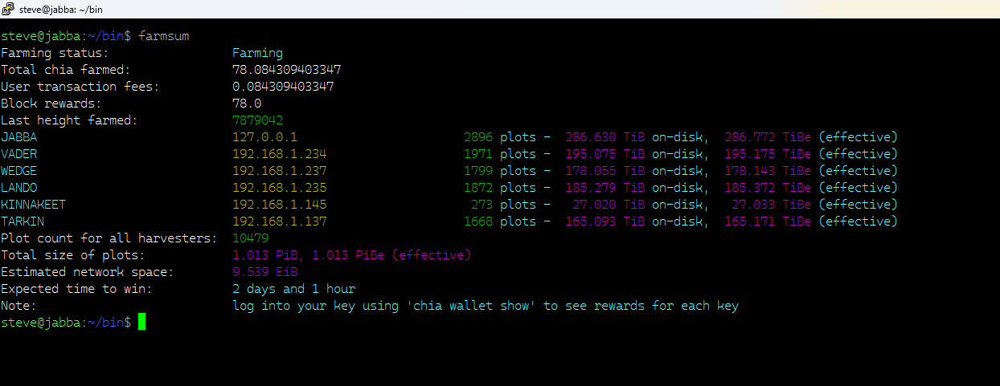

# 🌱 Chia Farm Summary Formatter

This Bash script enhances the output of the `chia farm summary` command by formatting and colorizing key metrics, aligning plot data, and mapping harvester IPs to friendly names. It’s designed for readability and quick insights into your farming setup.

---

## 📦 Installation

### 1. Save the script

Download or copy the script and save it as `chia_summary.sh` in your home directory’s `bin` folder:

```bash
mkdir -p ~/bin
nano ~/bin/chia_summary.sh
```

Paste the script into the editor, then save and exit (`Ctrl+O`, `Enter`, `Ctrl+X`).

### 2. Edit `chia_summary.sh` script and update the `harvester_names` collection for your configuration. This will map the IP Addresses to a Nickname.

### 3. Make it executable

```bash
chmod +x ~/bin/chia_summary.sh
```

### 4. Add `~/bin` to your PATH (if not already)

Edit your shell profile (`~/.bashrc`, `~/.zshrc`, or `~/.profile`) and add:

```bash
export PATH="$HOME/bin:$PATH"
```

Then reload your profile:

```bash
source ~/.bashrc   # or ~/.zshrc or ~/.profile
```

---

## 🚀 Usage

Run the script from any terminal:

```bash
chia_summary.sh
```

It will:
- Execute `chia farm summary`
- Format and colorize the output
- Align harvester data with friendly names and plot sizes

---

## 🛠 Customization

You can modify the script to:
- Add or change harvester IP-to-name mappings
- Adjust color schemes to match your terminal theme
- Sort output by plot count or total size
- Log output to a file for historical tracking

---

## 📋 Example Output



---

## 🧠 Notes

- Requires the `chia` CLI to be installed and configured.
- Colors may vary depending on your terminal emulator.
- For best results, use in a terminal that supports ANSI escape codes.
- You can disable color output by modifying the script to remove ANSI codes if needed.

---

## 📄 License

This project is licensed under the [Apache License 2.0](https://www.apache.org/licenses/LICENSE-2.0).

```

